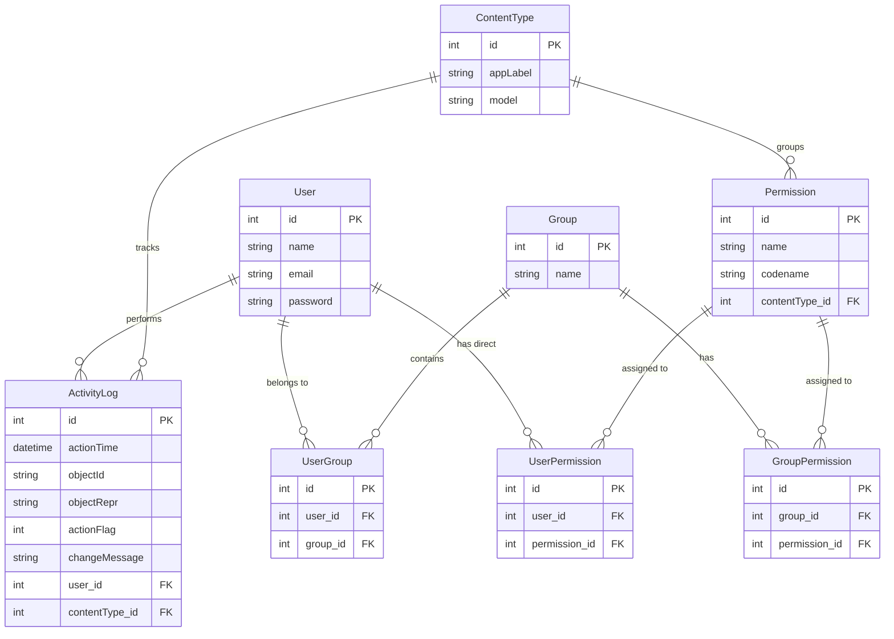

# Symfony ACL Boilerplate

A comprehensive Role-Based Access Control (RBAC) Management System boilerplate. 
This project follows a modern **decoupled architecture**, consisting of a Symfony REST API backend and a Nuxt (Vue 3) frontend.

## 📂 Architecture & Directory Structure

The repository is split into two independent applications:

- **[`/api`](./api/)**: A strict Symfony 6.4+ RESTful API utilizing the Data Mapper pattern, request DTOs, and JWT/Session authentication.
- **[`/frontend`](./frontend/)**: A standalone Nuxt (Vue 3) application providing the UI for the dashboard and permission management.

---

## 🚀 Getting Started

To run the full stack locally, you need to start both the API and the Frontend development servers.

### 1. Running the API (Backend)
```bash
cd api
composer install

# Setup your .env database credentials, then run:
php bin/console doctrine:database:create
php bin/console doctrine:migrations:migrate
php bin/console doctrine:fixtures:load

# Start the Symfony server (or use Laragon/Docker)
symfony server:start
# OR
php -S 127.0.0.1:8000 -t public
```

### 2. Running the Frontend (UI)
```bash
cd frontend
npm install;

# Start the Nuxt development server
npm run dev
```

---

## 🗄️ Entity Relationship Diagram (ERD)

The ACL (Access Control List) system uses a robust Django-style permissions database schema.




