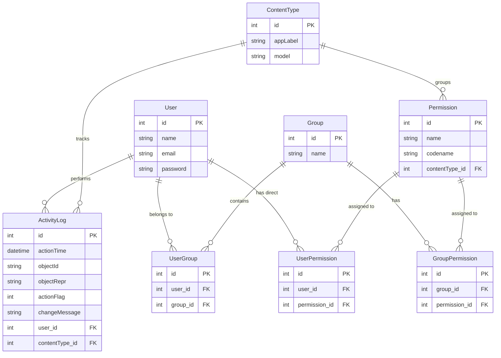

# symfony_acl
ACL Boilerplate

## Entity Relationship Diagram (ERD)

```mermaid
erDiagram
    User {
        int id PK
        string name
        string email
        string password
    }
    Group {
        int id PK
        string name
    }
    Permission {
        int id PK
        string name
        string codename
        int contentType_id FK
    }
    ContentType {
        int id PK
        string appLabel
        string model
    }
    UserGroup {
        int id PK
        int user_id FK
        int group_id FK
    }
    UserPermission {
        int id PK
        int user_id FK
        int permission_id FK
    }
    GroupPermission {
        int id PK
        int group_id FK
        int permission_id FK
    }
    ActivityLog {
        int id PK
        datetime actionTime
        string objectId
        string objectRepr
        int actionFlag
        string changeMessage
        int user_id FK
        int contentType_id FK
    }

    User ||--o{ UserGroup : "belongs to"
    Group ||--o{ UserGroup : "contains"
    
    User ||--o{ UserPermission : "has direct"
    Permission ||--o{ UserPermission : "assigned to"
    
    Group ||--o{ GroupPermission : "has"
    Permission ||--o{ GroupPermission : "assigned to"

    ContentType ||--o{ Permission : "groups"
    
    User ||--o{ ActivityLog : "performs"
    ContentType ||--o{ ActivityLog : "tracks"
```
