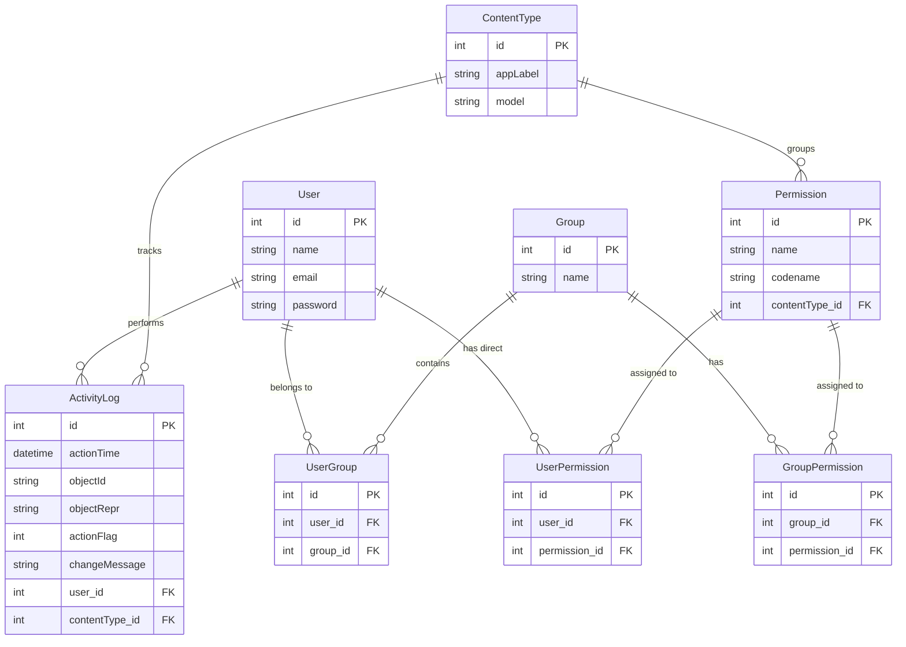

# Symfony ACL Boilerplate

A comprehensive Role-Based Access Control (RBAC) Management System boilerplate. 
This project follows a modern **decoupled architecture**, consisting of a Symfony REST API backend and a Nuxt (Vue 3) frontend.

## 📂 Architecture & Directory Structure

The repository is split into two independent applications:

- **[`/api`](./api/)**: A strict Symfony 6.4+ RESTful API utilizing the Data Mapper pattern, request DTOs, and JWT/Session authentication.
- **[`/frontend`](./frontend/)**: A standalone Nuxt (Vue 3) application providing the UI for the dashboard and permission management.

---

## 🚀 Getting Started

To run the full stack locally, you need to start both the API and the Frontend development servers.

### 1. Running the API (Backend)
```bash
cd api
composer install

# Setup your .env database credentials, then run:
php bin/console doctrine:database:create
php bin/console doctrine:migrations:migrate
php bin/console doctrine:fixtures:load

# Start the Symfony server (or use Laragon/Docker)
symfony server:start
# OR
php -S 127.0.0.1:8000 -t public
```

### 2. Running the Frontend (UI)
```bash
cd frontend
npm install;

# Start the Nuxt development server
npm run dev
```

---

## 🗄️ Entity Relationship Diagram (ERD)

The ACL (Access Control List) system uses a robust Django-style permissions database schema.



## 🛠️ Technologies & Impact

### Backend: Symfony & Doctrine
*   **Symfony 6.4+ (PHP 8+)**: Provides an extremely stable, enterprise-grade foundation. Its strict typing and robust HTTP framework ensure secure, predictable, and highly performant API endpoints.
*   **Doctrine ORM**: The Data Mapper pattern decouples the database schema from the application logic. This makes complex RBAC relationships (Users, Groups, Permissions) easy to manage, query, and scale without writing raw SQL.
*   **Decoupled API Architecture**: Utilizing Request DTOs and strict serialization means the API is perfectly isolated. It can serve the Nuxt frontend today, and a mobile app tomorrow, without changing backend logic.

### Frontend: Nuxt 3 & Vue 3
*   **Nuxt 3**: Offers a world-class developer experience with auto-imports, file-based routing, and robust state management. It significantly reduces boilerplate, allowing rapid development of complex administrative interfaces.
*   **Vue 3 (Composition API)**: Enables highly reactive and modular UI components. Managing dynamic states like permission toggles and user sessions is clean and efficient.
*   **TailwindCSS & Flowbite**: Utility-first styling combined with accessible components ensures a beautiful, responsive, and maintainable dashboard design without fighting custom CSS files.
*   **ApexCharts & ApexTree**: Transforms raw backend data into highly interactive, visual representations (such as the interactive Database Schema), providing immediate value and insights to administrators.

### Overall Architectural Impact
By splitting this project into two independent applications (Headless API + Nuxt SPA), we achieve a true **separation of concerns**. Frontend developers can iterate on the UI independently of backend developers who are optimizing database queries. This architecture is built to scale, maintain high security standards, and effortlessly adapt to future business requirements.
