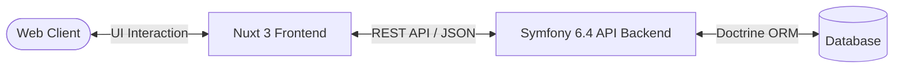
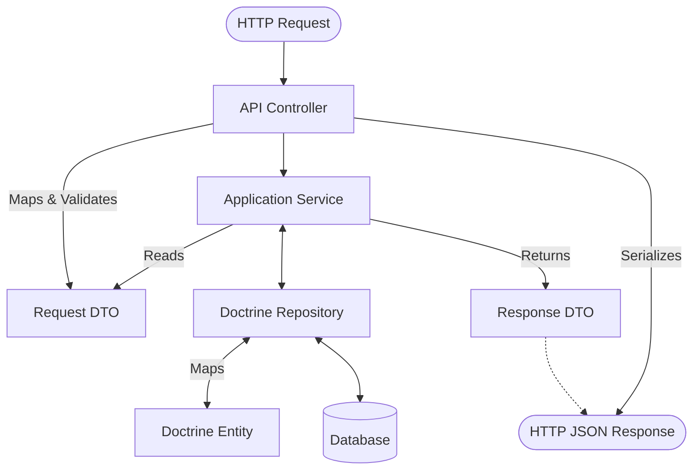
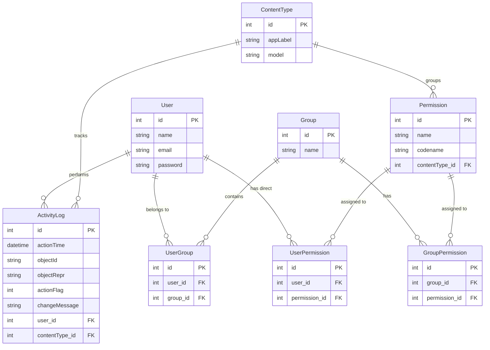

<div align="center">
  <h1>🛡️ Symfony ACL Boilerplate</h1>
  <p><strong>Enterprise-Grade Role-Based Access Control (RBAC) & Decoupled Architecture</strong></p>

  <!-- TECH STACK BADGES -->
  <p>
    
    
    
    
    
    
    
    
  </p>
</div>

---

> **Mission Statement**: To provide a battle-tested, high-performance foundation for B2B SaaS products and internal tools. This decoupled boilerplate accelerates enterprise software development by solving complex authorization logic, ensuring low-latency permission evaluation, and reducing compliance overhead.

## 💼 Business Impact & Value

While this project is built on modern, scalable technology, its primary architectural goal is to solve critical business challenges:

- **Reduced Operational Risk & Liability:** Prevents unauthorized access to sensitive business data through a granular, context-aware permission schema.
- **Enterprise-Ready Compliance:** Built-in polymorphic activity tracking and strict access controls provide the necessary foundation for meeting stringent compliance requirements (SOC2, GDPR, HIPAA).
- **Scalable Organizational Growth:** Group-based permission management allows administrative overhead to remain low even as employee and user counts scale massively.
- **Faster Time-to-Market:** Serves as a ready-to-deploy foundation for enterprise applications, saving weeks of expensive engineering time and allowing the product team to focus on core features.
- **Seamless User Experience:** A premium, intuitive Nuxt 3 dashboard ensures that non-technical managers and administrators can easily orchestrate complex organizational hierarchies.

---

## ⚡ Core Technical Features

- **Dynamic ACL & Context-Aware Authorization**: Implements highly flexible, attribute-based access control leveraging custom Symfony Voters. Authorization rules are evaluated dynamically based on the current user's claims and the target resource context.
- **Polymorphic Audit Trail & Activity Logging**: Utilizes a Django-style `ContentType` pattern to map entity modifications universally. Every critical action is recorded with high fidelity, guaranteeing an immutable audit log.
- **Request/Response DTO Pattern**: Ensures robust edge security. Incoming payloads are strictly hydrated into Request DTOs and validated via the Symfony Validator before ever interacting with the domain or persistence layers.
- **Low-Latency Permission Evaluation**: Designed with performance in mind. Permission checking incorporates caching strategies and optimized query resolution, ensuring that granular access checks do not become a bottleneck at scale.
- **Granular Frontend Rendering**: The Nuxt 3 (Vue 3) frontend utilizes composables and custom directives perfectly synchronized with the backend ACL, ensuring UI components are conditionally rendered based on the user's real-time permission matrix.

---

## 📂 Repository Structure

The repository enforces a clean, decoupled architecture consisting of a standalone REST API and an independent frontend.

```text
symfony_acl/
├── api/                             # Symfony 6.4 RESTful API (Backend)
│   ├── src/
│   │   ├── Controller/              # Thin API endpoints mapping HTTP to Services
│   │   ├── DTO/                     # Request/Response Data Transfer Objects
│   │   ├── Entity/                  # Doctrine ORM Models (Rich Domain)
│   │   ├── Repository/              # Database interaction & custom queries
│   │   ├── Security/
│   │   │   └── Voter/               # Context-aware ACL evaluation logic
│   │   └── Service/                 # Core Application & Business Logic
│   └── tests/                       # Unit and Integration Test Suites
│
└── frontend/                        # Nuxt 3 / Vue 3 SPA (Frontend)
    ├── components/                  # Reusable Vue components
    ├── composables/                 # Reusable state and logic (e.g., useAcl)
    ├── pages/                       # Vue-router mapped views
    └── middleware/                  # Route guards mapping to backend JWT states
```

---

## 🏗️ Architectural Highlights

To guarantee high cohesion and low coupling, this project strictly adheres to **SOLID principles** and the **Data Mapper pattern**.

### System Architecture (Separation of Concerns)

By fully decoupling the presentation layer (Nuxt) from the domain logic (Symfony), the system can scale independently. Communication is exclusively handled via a stateless REST API secured by JWTs.



### Backend Coding Pattern (Data Mapper & DTOs)

To prevent mass assignment vulnerabilities and ensure domain entities are never polluted by HTTP request concerns, we employ strict Data Transfer Objects (DTOs).



---

## 🧑‍💻 Code Highlights

### Strictly Typed Request DTOs
*Showcasing how incoming HTTP requests are validated before reaching the domain.*

```php
// TODO: Insert Request DTO snippet here
```

### Context-Aware Custom ACL Voter
*Showcasing dynamic permission evaluation against domain entities.*

```php
// TODO: Insert Security Voter snippet here
```

---

## 🗄️ Entity Relationship Diagram (ERD)

The ACL (Access Control List) system uses a robust Django-style permissions database schema, enabling infinite combinations of Groups, Users, and Resource Permissions.



---

## 🛡️ Production Ready & CI/CD

To maintain enterprise-grade software quality, this project integrates robust Quality Assurance and Continuous Integration workflows:

- **Static Analysis**: Enforced via **PHPStan** (Level 8/Max) to catch typed errors and edge cases before runtime.
- **Code Formatting**: Enforced via **PHP-CS-Fixer**, maintaining consistent PSR-12 standard styles across the team.
- **Continuous Integration**: Automated **GitHub Actions** CI workflows trigger on every Pull Request, automatically running linters, static analysis, and unit test suites to prevent regressions from reaching the main branch.

---

## 🚀 Getting Started

To run the full stack locally, you need to start both the API and the Frontend development servers.

### 1. Running the API (Backend)
```bash
cd api
composer install

# Setup your .env database credentials, then run:
php bin/console doctrine:database:create
php bin/console doctrine:migrations:migrate
php bin/console doctrine:fixtures:load

# Start the Symfony server (or use Laragon/Docker)
symfony server:start
# OR
php -S 127.0.0.1:8000 -t public
```

### 2. Running the Frontend (UI)
```bash
cd frontend
npm install

# Start the Nuxt development server
npm run dev
```
